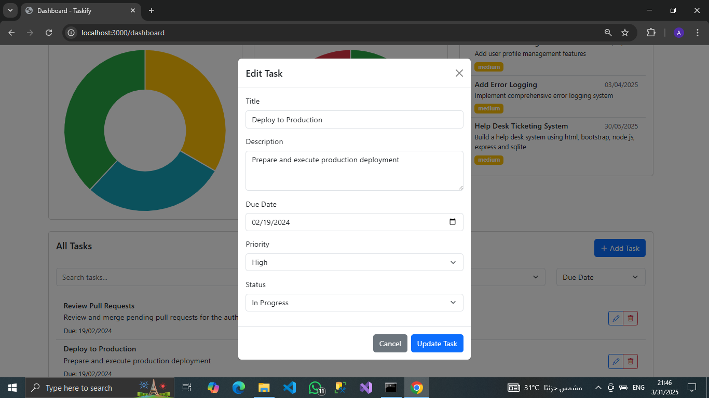

# Taskify - Personal Task Manager

A modern, feature-rich task management system built with Node.js, Express, SQLite, and Bootstrap.

## Features

- Task creation and management
- Priority-based task organization
- Task status tracking
- Interactive dashboard with charts
- Detailed analytics and reports
- Responsive design for all devices

## Prerequisites

- Node.js (v14 or higher)
- npm (Node Package Manager)

## Installation

1. Clone the repository:
```bash
git clone <repository-url>
cd taskify
```

2. Install dependencies:
```bash
npm install
```

3. Start the application:
```bash
npm start
```

For development with auto-reload:
```bash
npm run dev
```

The application will be available at `http://localhost:3000`

## Project Structure

```
taskify/
├── database/
│   └── db.js           # Database configuration and setup
├── public/
│   ├── index.html      # Landing page
│   ├── dashboard.html  # Task management dashboard
│   └── reports.html    # Analytics and reports
├── server.js           # Express server and API routes
├── package.json        # Project dependencies
└── README.md          # This file
```

## API Endpoints

- `GET /api/tasks` - Get all tasks
- `POST /api/tasks` - Create a new task
- `PUT /api/tasks/:id` - Update a task
- `DELETE /api/tasks/:id` - Delete a task

## Database Schema

The application uses SQLite with the following schema:

```sql
CREATE TABLE tasks (
    id INTEGER PRIMARY KEY AUTOINCREMENT,
    title TEXT NOT NULL,
    description TEXT,
    due_date TEXT,
    priority TEXT CHECK(priority IN ('low', 'medium', 'high')),
    status TEXT CHECK(status IN ('pending', 'in_progress', 'completed')),
    created_at DATETIME DEFAULT CURRENT_TIMESTAMP
);
```

## Screenshots

### Register Page


### Login Page


### Calendar View


### Report Page


### Modal Example


### Dashboard


## Contributing

1. Fork the repository
2. Create your feature branch (`git checkout -b feature/amazing-feature`)
3. Commit your changes (`git commit -m 'Add some amazing feature'`)
4. Push to the branch (`git push origin feature/amazing-feature`)
5. Open a Pull Request

## License

This project is licensed under the MIT License - see the LICENSE file for details. 